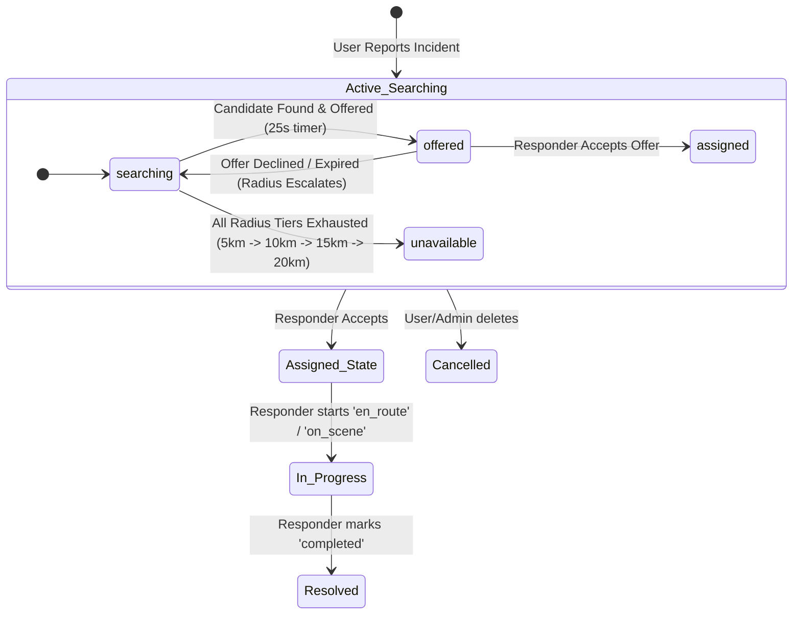
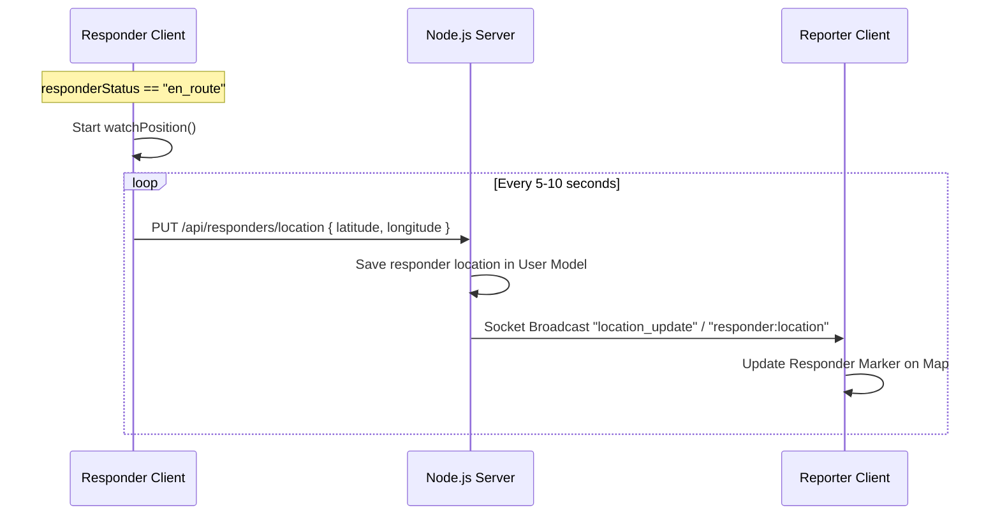

# Sahayog - Emergency Response System
## Frontend & Design Integration Guide (Handover Context)

This document provides a comprehensive blueprint of the current Sahayog system architecture, state transitions, API endpoints, and Socket.IO real-time events. It is structured to help the **Design Team** create the necessary user interfaces and the **Frontend Team** wire them up to the backend without breaking existing features.

---

## 📌 Architectural Overview & State Machine

Sahayog is a real-time emergency coordination platform. The lifecycle of an emergency incident progresses through specific database states, which are modified via atomic HTTP endpoints and synchronized via targeted Socket.IO rooms.

### Emergency & Dispatch States
An emergency's lifecycle is determined by two fields on the `Emergency` document: `status` and `dispatchStatus`.



---

## 📋 Complete Incident & Dispatch Flow

Here is the step-by-step sequence of events when an emergency is created, dispatched, accepted, and tracked.

| Step | Action/Event | Performed By | Technical Details (API/Socket) | UI/Design Requirements |
|:---|:---|:---|:---|:---|
| **1** | **Report Incident** | User (Reporter) | `POST /api/emergencies`<br>Payload: `{ type, description, longitude, latitude, address }` | A reporting form with a location picker map (Leaflet) and emergency type selector. |
| **2** | **Start Dispatch** | Backend Engine | Automatic trigger upon incident creation. Sets state to `searching` and initial radius to `5km`. | Reporter sees a loading/searching screen: *"Finding nearest responders..."* |
| **3** | **Rank & Offer** | Backend Engine | Filters available responders by skills + location. Ranks using OSRM ETA. Creates a `DispatchAttempt` (expires in 25s). | **No UI update yet**, background matching is running. |
| **4** | **Offer Broadcast** | Socket Server | Emits `dispatch:offer` to Room `user:<responderId>` | Responder gets a **25-second overlay countdown modal** showing the incident type, description, and ETA. |
| **5** | **Accept Offer** | Responder | `POST /api/dispatch/:attemptId/accept` | Responder clicks **"Accept"** on the modal. Modal closes, and responder is redirected to their **Active Assignment page**. |
| **5b** | **Decline / Expiry** | Responder / Worker | `POST /api/dispatch/:attemptId/decline` OR wait 25s for the backend `dispatchWorker` sweep. | Responder clicks **"Decline"** (or timer hits 0). Modal closes. Backend automatically scales radius (up to 20km) and searches for next candidate. |
| **6** | **Room Subscription** | Frontend Clients | Clients emit socket event `emergency:join` with `{ emergencyId }` to join the room `emergency:<emergencyId>` | Both Reporter and Responder subscribe to get live status updates. |
| **7** | **Tracking & Updates** | Assigned Responder | `PATCH /api/emergencies/:id/status` (updates `responderStatus` to `en_route` -> `on_scene` -> `completed`) | Responder panel shows buttons: **"Start Journey"** (en_route), **"Arrived"** (on_scene), **"Mark Resolved"** (completed). |
| **8** | **Status Sync** | Socket Server | Emits `emergency:statusUpdate` to Room `emergency:<emergencyId>` | Reporter and Admin screens update the header status dynamically (e.g., "Responder En Route", "Responder Arrived", "Resolved"). |

---

## ⚡ Socket.IO Integration Specifications (Mismatches & Corrections)

> [!WARNING]
> The frontend socket hook currently has some legacy patterns that will cause authentication failures and console errors with the updated backend. Please ensure the following adjustments are made.

### 1. Socket Authentication (Crucial)
The backend now enforces strict JWT authentication for all socket connections. Any connection without a token in the handshake auth payload is rejected.
* **Correction required in [useSocket.js](file:///c:/Users/Lenovo/Desktop/PROJECT/Sahayog/frontend/src/hooks/useSocket.js):**
  ```javascript
  // Pass the JWT during socket initialization
  socketRef.current = io(SOCKET_URL, {
    auth: {
      token: localStorage.getItem("token") // Retrieve token from local storage
    },
    reconnection: true,
    reconnectionAttempts: 5
  });
  ```

### 2. Client-Controlled `join` Event Removed
* **Legacy:** The frontend used to call `socket.emit('join', user.id)` upon connection.
* **Current Backend:** The server automatically extracts the user ID from the JWT token and joins the socket to room `user:<userId>` automatically. **Remove the client-side `join` emit** from [UserDashboard.jsx](file:///c:/Users/Lenovo/Desktop/PROJECT/Sahayog/frontend/src/pages/user/UserDashboard.jsx#L131) and [ResponderDashboard.jsx](file:///c:/Users/Lenovo/Desktop/PROJECT/Sahayog/frontend/src/pages/responder/ResponderDashboard.jsx#L72).

### 3. Subscribing to an Emergency Room
To receive live tracking and status updates, the client must ask to join the specific emergency's socket room:
```javascript
// Emit join request on details view mount
socket.emit("emergency:join", emergencyId, (response) => {
  if (response.ok) {
    console.log("Successfully subscribed to emergency room");
  } else {
    console.error("Access forbidden or room invalid");
  }
});
```

---

## 🛠️ Feature 7 & 8: Implementation Design

The backend is already prepared to support the remaining features. Below is the blueprint for how the design and frontend teams can implement them without disrupting existing database logic.

### Feature 7: Live-Location Tracking
This feature allows the reporter and admin to watch the responder's live coordinate markers move on the map in real time.



#### UI/UX Requirements (Design Team)
* **Reporter Map:** When the emergency status is `assigned` or `in_progress`, the Leaflet map must show two markers:
  1. **Red Pin:** The incident location.
  2. **Ambulance/Responder Icon:** The responder's live position (smoothly transitioning between coordinate updates).
* **Responder Dashboard:** A navigation screen layout. While `en_route`, show a prominent indicator: *"Your location is being shared with the reporter."*

#### Frontend Coding (Frontend Team)
1. **Responder Location Watcher:**
   In [ResponderDashboard.jsx](file:///c:/Users/Lenovo/Desktop/PROJECT/Sahayog/frontend/src/pages/responder/ResponderDashboard.jsx), track geolocation when status is `en_route`:
   ```javascript
   useEffect(() => {
     if (status !== 'en_route') return;

     const watchId = navigator.geolocation.watchPosition(
       async (position) => {
         const { latitude, longitude } = position.coords;
         // Send to backend database
         await updateLocation({ latitude, longitude });
       },
       (err) => console.error(err),
       { enableHighAccuracy: true, maximumAge: 0, timeout: 5000 }
     );

     return () => navigator.geolocation.clearWatch(watchId);
   }, [status]);
   ```
2. **Reporter Location Listener:**
   In [UserDashboard.jsx](file:///c:/Users/Lenovo/Desktop/PROJECT/Sahayog/frontend/src/pages/user/UserDashboard.jsx), join the emergency room and listen for updates:
   ```javascript
   // Listen for the location update of the assigned responder
   socket.on("location_update", (data) => {
     if (data.responderId === assignedResponderId) {
       setResponderCoordinates([data.latitude, data.longitude]);
     }
   });
   ```

---

### Feature 8: A* Route Display & Navigation
This feature draws a route line connecting the responder and the emergency incident location on the maps of both the reporter and responder.

#### UI/UX Requirements (Design Team)
* **Map Route Line:** Draw a clean, semi-transparent colored path (e.g., solid blue or green line) along the roads from the responder's current location to the incident.
* **Turn-by-Turn Card:** (Optional) An overlay showing distance remaining and estimated travel time (ETA) updated in real time.

#### Frontend Coding (Frontend Team)
Instead of executing raw math in React, use the routing coordinates from the backend or OSRM directly to render a Leaflet Polyline:
1. **Draw Route on Map:**
   Use the `RouteDisplay` component to draw the line using coordinates:
   ```javascript
   import { Polyline } from "react-leaflet";

   export default function RouteDisplay({ responderCoords, incidentCoords }) {
     const [routePoints, setRoutePoints] = useState([]);

     useEffect(() => {
       if (!responderCoords || !incidentCoords) return;

       // Fetch route points from OSRM / Routing API
       const fetchRoute = async () => {
         const response = await fetch(
           `http://router.project-osrm.org/route/v1/driving/${responderCoords[1]},${responderCoords[0]};${incidentCoords[1]},${incidentCoords[0]}?overview=full&geometries=geojson`
         );
         const data = await response.json();
         if (data.routes && data.routes[0]) {
           // OSRM returns [longitude, latitude] — swap to [latitude, longitude] for Leaflet
           const coords = data.routes[0].geometry.coordinates.map(pt => [pt[1], pt[0]]);
           setRoutePoints(coords);
         }
       };

       fetchRoute();
     }, [responderCoords, incidentCoords]);

     return routePoints.length > 0 ? (
       <Polyline positions={routePoints} color="#3b82f6" weight={5} opacity={0.7} />
     ) : null;
   }
   ```

---

## 🛠️ Summary Checklist for Handover

### For the Design Team
* [ ] **Reporter - Searching State UI:** A clean loading page or map overlay stating "Finding your responder..." with a pulse animation.
* [ ] **Responder - Offer Modal Alert:** A modal popup that blocks other interactions. Must have a large circular countdown timer (25s) and prominent **Accept** (Green) and **Decline** (Red) buttons.
* [ ] **Responder - Action Tray:** Bottom sheet/overlay with clear actions: "Start Journey", "Arrive on Scene", "Complete Rescue".
* [ ] **Map Route Visualization:** Design a custom styling sheet for the OSRM route line and distinctive icons for the incident and the responder vehicle.

### For the Frontend Team
* [ ] **Socket Token Handshake:** Update [useSocket.js](file:///c:/Users/Lenovo/Desktop/PROJECT/Sahayog/frontend/src/hooks/useSocket.js) to send the JWT in the `auth` handshake block.
* [ ] **Remove Client `join` Emits:** Clean up the dashboard mounting code.
* [ ] **Implement Offer Modal Listener:** In `ResponderDashboard.jsx`, listen to `dispatch:offer`, open the modal, and hook up the 25-second countdown.
* [ ] **Implement Accept/Decline APIs:** Connect the offer modal buttons to `POST /api/dispatch/:attemptId/accept` and `POST /api/dispatch/:attemptId/decline`.
* [ ] **Implement `emergency:join`:** Request room access when the user enters the active tracking details screen or dashboard assignment page.
* [ ] **Implement watchPosition:** Capture responder coords when status is `en_route` and PUT to `/api/responders/location`.
* [ ] **Implement Leaflet Polyline:** Load route coordinates using the OSRM router endpoint and display them using `<Polyline />`.
