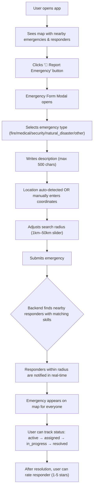
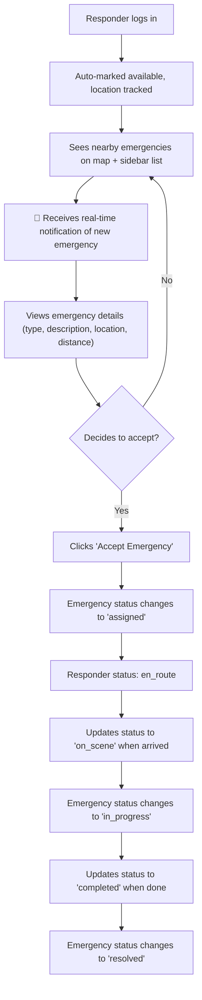
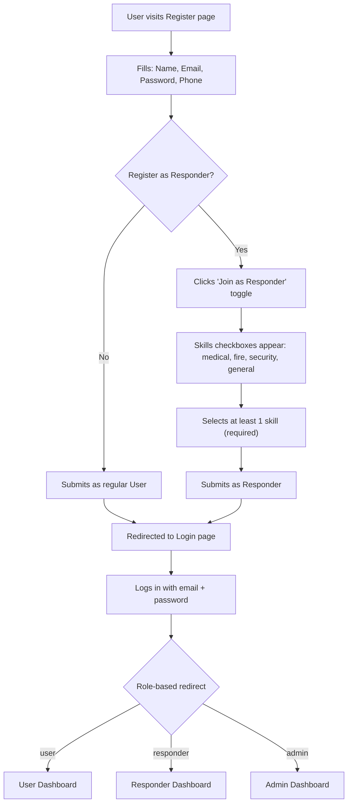

# 🚨 Sahayog — Emergency Response System
## Complete UI/UX Design Specification for Figma

> **Project**: Sahayog (सहयोग — "Cooperation" in Nepali)
> **Type**: Real-time emergency coordination web platform
> **Tech Stack**: React.js + Leaflet Maps + Socket.IO (real-time) + MongoDB
> **Target Region**: Nepal (default map center: Kathmandu — 27.7172°N, 85.3240°E)
> **Team**: Shweta Neupane, Akshyata Khanal, Nancy Rai

---

## Table of Contents

1. [Project Overview & Goals](#1-project-overview--goals)
2. [User Roles & Personas](#2-user-roles--personas)
3. [Information Architecture & Sitemap](#3-information-architecture--sitemap)
4. [User Flows](#4-user-flows)
5. [Data Models & Field Reference](#5-data-models--field-reference)
6. [Screen-by-Screen Specifications](#6-screen-by-screen-specifications)
7. [Reusable Component Library](#7-reusable-component-library)
8. [Real-Time Features & Notifications](#8-real-time-features--notifications)
9. [Design System & Guidelines](#9-design-system--guidelines)
10. [Responsive & Accessibility Notes](#10-responsive--accessibility-notes)

---

## 1. Project Overview & Goals

### What is Sahayog?
Sahayog is a **web-based emergency response system** that connects people in emergency situations with nearby responders (medical, fire, security) in real-time. Think of it as a **dispatch system** where:

- **Civilians** can report emergencies with their location
- **Responders** (volunteers/professionals) get notified of nearby emergencies and can accept/respond
- **Admins** oversee the entire system, monitor all emergencies, and manage users

### Core Features (Already Built in Backend)
| Feature | Status |
|---|---|
| User registration & login (JWT auth) | ✅ Built |
| Role-based access (user/responder/admin) | ✅ Built |
| Emergency creation with geolocation | ✅ Built |
| Nearby responder detection (Haversine formula) | ✅ Built |
| Real-time notifications via Socket.IO | ✅ Built |
| Responder accept/status updates | ✅ Built |
| Admin dashboard with statistics | ✅ Built |
| Interactive map with Leaflet | ✅ Built |
| Live location tracking for responders | ✅ Built |
| Feedback/rating system (1-5 stars) | ✅ Built |
| A* routing algorithm | 🔧 Commented out (future) |
| Profile management & password change | ✅ Built |

### What the Designer Needs to Do
The frontend currently has **functional but unstyled** pages with inline styles and no design system. The designer needs to create **pixel-perfect Figma designs** for all screens listed below, which will then be implemented in code.

---

## 2. User Roles & Personas

### Role 1: Civilian User (`role: "user"`)
> **Persona**: Riya, 28, a resident of Kathmandu who witnesses a road accident

- Can register/login as a regular user
- Can report emergencies (fire, medical, security, natural disaster, other)
- Can see nearby emergencies and available responders on a map
- Can track the status of their reported emergencies
- Can give feedback (1-5 star rating) on responders after emergency is resolved
- Can manage their profile (name, phone)
- Can change their password

### Role 2: Emergency Responder (`role: "responder"`)
> **Persona**: Sanjay, 35, a trained paramedic volunteer

- Registers with specific **skills** (medical, fire, security, general — at least one required)
- Can toggle **availability** (online/offline duty status)
- Location is **continuously tracked** and shared with the system
- Gets **real-time notifications** of nearby emergencies matching their skills
- Can **accept** emergencies and update status (en_route → on_scene → completed)
- Can also report emergencies themselves
- Has a response history and receives feedback ratings

### Role 3: Admin (`role: "admin"`)
> **Persona**: Priya, 42, an emergency coordination center manager

- Has a **god view** of all emergencies and all responders on the map
- Sees real-time **dashboard statistics** (total emergencies, active, completed, available responders, avg response time)
- Can manage all users (view, delete)
- Can see all responders (filter by availability)
- Can view detailed emergency information including assigned responders
- Receives real-time updates on all system events

---

## 3. Information Architecture & Sitemap

```mermaid
graph TD
    A["🏠 Landing Page (/)"] --> B["🔐 Login (/login)"]
    A --> C["📝 Register (/register)"]
    
    B --> D["👤 User Dashboard (/user-dashboard)"]
    B --> E["🚑 Responder Dashboard (/responder-dashboard)"]
    B --> F["🛡️ Admin Dashboard (/admin-dashboard)"]
    
    D --> D1["Map View + Nearby Emergencies"]
    D --> D2["Report Emergency (Modal)"]
    D --> D3["Emergency Details (Modal)"]
    D --> D4["My Emergencies List"]
    D --> D5["Profile Page"]
    D --> D6["Settings / Change Password"]
    
    E --> E1["Map View + Nearby Emergencies"]
    E --> E2["Availability Toggle"]
    E --> E3["Active Assignments"]
    E --> E4["Accept Emergency"]
    E --> E5["Status Update (Modal)"]
    E --> E6["Report Emergency (Modal)"]
    E --> E7["Profile Page"]
    
    F --> F1["Statistics Overview"]
    F --> F2["Map View (All Emergencies + Responders)"]
    F --> F3["All Emergencies List"]
    F --> F4["All Responders List"]
    F --> F5["All Users List"]
    F --> F6["Emergency Details (Modal)"]
    F --> F7["User Details"]
    F --> F8["Profile / Analytics"]
```



---

## 4. User Flows

### Flow 1: Emergency Reporting (Civilian User)



### Flow 2: Emergency Response (Responder)



### Flow 3: Registration Flow



---

## 5. Data Models & Field Reference

> [!IMPORTANT]
> These are the exact data fields from the backend. All form inputs and display elements must map to these fields.

### User Model

| Field | Type | Rules | Notes |
|---|---|---|---|
| `name` | String | Required, trimmed | Display name |
| `email` | String | Required, unique, lowercase | Login credential |
| `password` | String | Required, min 6 chars | Never shown in UI, hashed |
| `phone` | String | Required, 10 digits | Contact number |
| `role` | Enum | `user` \| `responder` \| `admin` | Default: `user` |
| `skills` | Array of Enum | `medical` \| `fire` \| `security` \| `general` | Required for responders (≥1) |
| `isAvailable` | Boolean | Default: `false` | Responder duty status |
| `location` | GeoJSON Point | `[longitude, latitude]` | Responder's live location |
| `responseHistory` | Array | `{emergencyId, responseTime, feedback}` | Responder's past responses |
| `createdAt` | Date | Auto-generated | Account creation date |

### Emergency Model

| Field | Type | Rules | Notes |
|---|---|---|---|
| `createdBy` | ObjectId → User | Required | Who reported |
| `type` | Enum | `fire` \| `medical` \| `security` \| `natural_disaster` \| `other` | Emergency category |
| `description` | String | Max 500 chars, trimmed | Situation description |
| `location.type` | String | Always `"Point"` | GeoJSON format |
| `location.coordinates` | [Number] | `[longitude, latitude]`, required | Emergency location |
| `location.address` | String | Optional, trimmed | Human-readable address |
| `radius` | Number | Default: 10000 (meters) | Search radius for responders |
| `requiredSkills` | Array of Enum | `medical` \| `fire` \| `security` \| `general` | Auto-set based on type |
| `status` | Enum | `active` → `assigned` → `in_progress` → `resolved` \| `cancelled` | Emergency lifecycle |
| `responders` | Array | See sub-fields below | Assigned responders |
| `responders[].userId` | ObjectId → User | — | Responder reference |
| `responders[].status` | Enum | `notified` → `en_route` → `on_scene` → `completed` | Individual responder status |
| `responders[].notifiedAt` | Date | — | When notified |
| `responders[].respondedAt` | Date | — | When accepted |
| `responders[].arrivedAt` | Date | — | When arrived on scene |
| `responders[].completedAt` | Date | — | When completed |
| `responders[].feedback.rating` | Number | 1-5 | User rating for this responder |
| `resolvedAt` | Date | — | When emergency was resolved |
| `createdAt` | Date | Auto-generated | When reported |

### Skill-to-Emergency Type Mapping

| Emergency Type | Required Skills |
|---|---|
| 🔥 Fire | fire, medical |
| 🏥 Medical | medical |
| 🔒 Security | security, medical |
| 🌊 Natural Disaster | general, medical, security |
| 🆘 Other | general |

### Emergency Status Flow

```
active → assigned → in_progress → resolved
  ↓         ↓           ↓
cancelled cancelled   cancelled
```

---

## 6. Screen-by-Screen Specifications

---

### Screen 1: Landing Page (`/`)

**Purpose**: First impression. Conveys trust, urgency, and simplicity.

**Layout**:
- Full-width hero section
- Navbar at top with logo (left) + Login/Register buttons (right)
- If user is already logged in, auto-redirect to their dashboard

**Content Elements**:
| Element | Description |
|---|---|
| Logo | "Sahayog" (सहयोग) brand mark — suggest a shield/cross/location-pin icon |
| Headline | e.g., "Sahayog — Real-Time Emergency Response" or "Help is Just a Click Away" |
| Subheadline | Brief description: "Report emergencies, connect with nearby responders, save lives." |
| CTA Buttons | **"Report Emergency"** (primary, red/urgent) → goes to Register if not logged in; **"Join as Responder"** (secondary) → goes to Register with responder toggle |
| Feature Cards | 3-4 cards showcasing key features: (1) Quick Reporting, (2) Real-time Tracking, (3) Nearby Responders, (4) Live Map |
| Optional | A preview/illustration of the map interface, trust badges, stats counter |

**Behavior**:
- If user is already authenticated:
  - `admin` → redirect to `/admin-dashboard`
  - `responder` → redirect to `/responder-dashboard`
  - `user` → redirect to `/user-dashboard`

**Design Notes**:
- Use emergency-themed color palette (reds, whites, dark grays)
- Consider a subtle animated background or hero illustration
- Mobile responsive — stack elements vertically

---

### Screen 2: Login Page (`/login`)

**Purpose**: Authentication for all roles.

**Layout**: Centered card form on a clean background. Part of `LandingLayout` (has Navbar).

**Form Fields**:
| Field | Type | Validation | Placeholder |
|---|---|---|---|
| Email | `email` input | Required, valid email | "Enter your email" |
| Password | `password` input | Required | "Enter your password" |

**Buttons**:
- **"Login"** (primary) — shows "Logging in..." loading state
- **"Register"** link/button — navigates to `/register`

**Behavior**:
- On success: toast "Welcome back!", redirect based on role:
  - `admin` → `/admin-dashboard`
  - `responder` → `/responder-dashboard`
  - `user` → `/user-dashboard`
- On error: toast with error message from API
- Responders are auto-marked `isAvailable: true` on login

**Design Notes**:
- Consider a split layout (form on one side, illustration on other)
- Show/hide password toggle icon
- Clear error states on form fields

---

### Screen 3: Register Page (`/register`)

**Purpose**: Account creation for civilians and responders.

**Layout**: Centered card form, slightly taller than login. Part of `LandingLayout`.

**Form Fields**:
| Field | Type | Validation | Placeholder |
|---|---|---|---|
| Name | Text input | Required | "Full name" |
| Email | Email input | Required, valid format | "Email address" |
| Password | Password input | Required, min 6 chars | "Password (min 6 characters)" |
| Phone | Tel input | Required, exactly 10 digits | "10-digit phone number" |

**Responder Toggle Section**:
- A prominent toggle/button: **"Join as Responder"** / **"Cancel — Register as User"**
- When toggled ON, show a **Skills Fieldset** with checkboxes:
  - ☐ Medical 🏥
  - ☐ Fire 🔥
  - ☐ Security 🔒
  - ☐ General 🛠️
- At least 1 skill must be selected for responders

**Buttons**:
- **"Register"** (primary) — shows "Registering..." loading state
- **"Login"** link — navigates to `/login`

**Behavior**:
- On success: toast "Registration Successful!", redirect to `/login`
- On error: toast with specific error (e.g., "Email already registered")
- When toggling responder off, clear selected skills

**Design Notes**:
- The responder toggle should be visually distinct — perhaps a highlighted banner/card
- Skills could be styled as pill/chip selectors instead of plain checkboxes
- Consider step indicators if the form feels long

---

### Screen 4: User Dashboard (`/user-dashboard`)

**Purpose**: Main interface for civilians. Map-centric view with emergency reporting.

**Layout**: `DashboardLayout` — Sidebar (left, 250px) + Main Content area

**Overall Structure**:
```
┌──────────┬─────────────────────────────────┬──────────┐
│          │                                 │          │
│          │                                 │          │
│ Sidebar  │        Interactive Map          │ Info     │
│ (nav)    │     (Leaflet, full height)      │ Panel    │
│          │                                 │ (300px)  │
│          │   [Emergency Markers 🔴]        │          │
│          │   [Responder Markers 🟢]        │          │
│          │   [User Location 📍]            │          │
│          │                                 │          │
│          │                                 │          │
└──────────┴─────────────────────────────────┴──────────┘
```

**Sidebar Navigation Items** (for `user` role):
1. 📋 Profile
2. 🚨 My Emergencies
3. ➕ Create Emergency
4. ⚙️ Settings
5. 🚪 Logout (at bottom, red)

**Map Area**:
- Interactive Leaflet map centered on user's geolocation (fallback: Kathmandu)
- **Emergency Markers**: Red/orange pins for active emergencies nearby
  - Clicking opens Emergency Details Modal
- **Responder Markers**: Green pins for available responders nearby
  - Shows name and skills on hover/click
- **User's own location**: Blue dot/pin

**Right Info Panel (300px sidebar)**:
- **Welcome header**: "Welcome, {user.name}"
- **Nearby Emergencies section**:
  - Count badge: "Nearby Emergencies (3)"
  - Scrollable list of emergency cards:
    - Type (uppercase, with icon): "🔥 FIRE", "🏥 MEDICAL"
    - Description (truncated)
    - Status badge (color-coded)
    - Clickable → opens Emergency Details Modal
  - Empty state: "No emergencies nearby"
- **Available Responders section**:
  - Count badge: "Available Responders (5)"
  - List of responder cards:
    - Name + availability indicator (🟢 online / 🔴 offline)
    - Skills as tags/pills
  - Empty state: "No responders available"
- **Report Emergency Button** (full-width, red, prominent at bottom):
  - "🚨 Report Emergency"
  - Opens Emergency Form Modal

**Design Notes**:
- The map should take maximum visual space
- Info panel should be scrollable independently
- Emergency cards should have left-border color coding by type
- Consider a floating "Report Emergency" FAB button on the map as well

---

### Screen 5: Emergency Form Modal

**Purpose**: Report a new emergency. Used by both Users and Responders.

**Layout**: Full-screen overlay with centered modal card (max 500px wide)

**Form Fields**:
| Field | Type | Options/Validation | UI Suggestion |
|---|---|---|---|
| Emergency Type | Dropdown/Select | fire 🔥, medical 🏥, security 🔒, natural_disaster 🌊, other 🆘 | Icon-labeled dropdown or segmented control |
| Description | Textarea | Required, max 500 chars | Show char counter |
| Address/Location | Text input | Optional | "e.g., Main Street, Downtown" |
| Latitude | Number input | Auto-filled by geolocation | Read-only when auto-detected |
| Longitude | Number input | Auto-filled by geolocation | Read-only when auto-detected |
| Search Radius | Range slider | 1,000m – 50,000m, step 1,000 | Show value label: "5 km" |

**Buttons**:
- **"📍 Use My Location"** (blue, full-width) — triggers browser geolocation
- **"🚨 Create Emergency"** (red, primary) — shows "Creating..." loading
- **"Cancel"** (gray, secondary) — closes modal

**Behavior**:
- Auto-detects location on open (optional)
- Toast "Location detected!" on successful geolocation
- On submit success: toast "Emergency created successfully!", close modal, refresh emergency list
- Backend automatically finds and notifies nearby responders

**Design Notes**:
- Consider replacing lat/lng number inputs with a **map pin picker** (click on mini-map to set location)
- The emergency type could be displayed as visual cards/icons instead of a dropdown
- Radius slider should show a visual representation (circle on map preview)
- Add urgency indicators / severity levels in future

---

### Screen 6: Emergency Details Modal

**Purpose**: View detailed information about a specific emergency. Different content based on role.

**Layout**: Full-screen overlay with centered modal card

**Content (for User viewing their own emergency)**:
| Element | Description |
|---|---|
| Type | Large header with icon: "🔥 FIRE" |
| Description | Full description text |
| Status | Color-coded badge: `active`(orange), `assigned`(blue), `in_progress`(yellow), `resolved`(green), `cancelled`(gray) |
| Location/Address | Address string or coordinates |
| Created At | Formatted datetime |
| Responders Assigned | Count + list of responder names |
| **Feedback Section** | (Only shown when `status === "resolved"`) Star rating (1-5) for each responder |

**Content (for Responder)**:
- Same as above, plus:
- **"Accept" button** (green) — if not yet accepted
- **Reporter's phone** — for direct contact
- **Distance** — how far the emergency is

**Content (for Admin)**:
- Full details including:
- Reporter info (name, phone, email)
- All responder details with individual statuses
- Timestamps (notifiedAt, respondedAt, arrivedAt, completedAt)
- Full status history

**Close Button**: "Close" or X icon in corner

---

### Screen 7: Responder Dashboard (`/responder-dashboard`)

**Purpose**: Main interface for emergency responders. Map + assignment management.

**Layout**: Same `DashboardLayout` structure as User Dashboard but with different sidebar items and info panel content.

**Sidebar Navigation Items** (for `responder` role):
1. 👤 Profile
2. 🟢 Availability
3. 📍 My Location
4. 📋 Active Assignments
5. 🚨 Nearby Emergencies
6. ⚙️ Settings
7. 🚪 Logout (at bottom)

**Right Info Panel (320px)**:

**Section 1 — Responder Status Header**:
- Name: "{user.name}"
- Availability: 🟢 Online / 🔴 Offline (large indicator)
- Skills: Pill tags showing "medical", "fire", etc.
- **Toggle Button**: "Go Offline" (orange) / "Go Online" (green)
  - Full-width, prominent

**Section 2 — Active Assignments**:
- Header: "Active Assignments ({count})"
- Cards for each accepted emergency:
  - Type (uppercase with icon)
  - Description (truncated)
  - Status badge
  - **"Update Status" button** (blue) → opens Status Update Modal
- Empty state: "No active assignments"

**Section 3 — Report Emergency**:
- **"🚨 Report Emergency"** button (red, full-width)
- Responders can also report emergencies

**Section 4 — Nearby Emergencies**:
- Header: "Nearby Emergencies ({count})"
- Cards for each nearby active emergency:
  - Type + description
  - **"Accept" button** (blue) → accepts the emergency
  - Shows "Accepting..." loading state
- Empty state: "No emergencies nearby"

**Map Area**:
- Shows nearby emergency markers (red/orange)
- Responder's own location (highlighted)
- Center on responder's current geolocation

**Design Notes**:
- The availability toggle should be very prominent — responders need to quickly go on/off duty
- Active assignments should have priority visual placement over nearby emergencies
- Consider color-coding assignment cards by urgency

---

### Screen 8: Status Update Modal (Responder Only)

**Purpose**: Allows responders to update their progress on an accepted emergency.

**Layout**: Overlay modal

**Content**:
- Emergency info summary (type, description, location)
- Current status indicator
- **Status options** (radio buttons or large clickable cards):
  - 🚗 **En Route** — "I'm on my way"
  - 📍 **On Scene** — "I've arrived at the location"
  - ✅ **Completed** — "Emergency resolved"
- **"Update Status"** button (primary)
- **"Cancel"** button (secondary)

**Behavior**:
- Selecting "On Scene" → emergency status becomes `in_progress`
- Selecting "Completed" → emergency status becomes `resolved`, resolvedAt is set
- Real-time Socket.IO event broadcasts the update to all connected clients
- Toast notification on success

**Design Notes**:
- Status options should look like a **stepper/progress bar** showing the flow:
  `notified → en_route → on_scene → completed`
- Current step should be highlighted
- Completed steps should show a checkmark

---

### Screen 9: Admin Dashboard (`/admin-dashboard`)

**Purpose**: Command center overview of the entire emergency response system.

**Layout**: `DashboardLayout` with sidebar + expansive main area.

**Sidebar Navigation Items** (for `admin` role):
1. 📊 Dashboard
2. 👥 Users
3. 🚑 Responders
4. 🚨 All Emergencies
5. 📈 Analytics
6. 👤 Profile
7. 🚪 Logout (at bottom)

**Main Content Structure**:
```
┌────────────────────────────────────────────────────┐
│  Statistics Cards (Grid: 2×2 + 1)                  │
│  ┌──────────┬──────────┬───────────┬──────────┐    │
│  │  Total   │  Active  │ Available │  Total   │    │
│  │Emergency │Emergency │Responders │  Users   │    │
│  │   42     │    5     │    12     │   128    │    │
│  └──────────┴──────────┴───────────┴──────────┘    │
│  ┌─────────────────────────────────────────────┐   │
│  │      Avg Response Time: 8 mins              │   │
│  └─────────────────────────────────────────────┘   │
├────────────────────────────────────┬───────────────┤
│                                    │               │
│        Interactive Map             │  Emergency    │
│   (All emergencies + responders)   │  List Panel   │
│                                    │  (scrollable) │
│   [🔴 Emergency Markers]          │               │
│   [🟢 Responder Markers]          │               │
│                                    │               │
└────────────────────────────────────┴───────────────┘
```

**Statistics Cards** (2×2 grid + 1 full-width):

| Card | Color | Value | Label |
|---|---|---|---|
| Card 1 | Light Blue (#e3f2fd) | `stats.emergencies.total` | "Total Emergencies" |
| Card 2 | Light Green (#e8f5e9) | `stats.emergencies.active` | "Active Emergencies" |
| Card 3 | Light Orange (#fff3e0) | `stats.responders.available` | "Available Responders" |
| Card 4 | Light Purple (#f3e5f5) | `stats.users.total` | "Total Users" |
| Card 5 (full-width) | Light Pink (#fce4ec) | `stats.avgResponseTime` | "Avg Response Time" |

**Map Area**:
- Shows ALL emergencies (not just nearby)
- Shows ALL responders with location
- Color-coded markers:
  - 🔴 Active emergency
  - 🟡 Assigned/In Progress
  - 🟢 Resolved
  - 🔵 Available responder
  - ⚫ Offline responder
- Map center: average of all emergency coordinates (default: Kathmandu)
- Zoom level: 11 (wider than user/responder views)

**Emergency List Panel** (scrollable, right side):
- Header: "All Emergencies ({count})"
- Filter dropdown: By status (active/assigned/in_progress/resolved/cancelled)
- Filter dropdown: By type (fire/medical/security/natural_disaster/other)
- Each emergency card shows:
  - Type (uppercase, bold)
  - Address
  - Status (color-coded: active=orange, completed=green)
  - Responder count
  - Click → opens Emergency Details Modal

**Admin Footer**:
- Shows: "Admin: {user.name}"

---

### Screen 10: Profile Page (All Roles)

**Purpose**: View and edit user profile information.

**Layout**: Card-based layout within the dashboard content area.

**Display Fields (Read-Only)**:
| Field | Display |
|---|---|
| Name | Editable text |
| Email | Read-only (grayed out) |
| Phone | Editable text |
| Role | Badge/tag (user/responder/admin) |
| Member Since | Formatted date from `createdAt` |

**Responder-Specific Fields**:
| Field | Display |
|---|---|
| Skills | Pill tags (medical, fire, security, general) |
| Availability | 🟢/🔴 indicator |
| Location | Coordinates or "Location not set" |
| Response History | Count of past responses |

**Editable Fields**:
- Name (text input)
- Phone (10-digit number input)

**Buttons**:
- **"Save Changes"** (primary) — updates profile via API
- **"Change Password"** (secondary) — opens Change Password section/modal

**Design Notes**:
- Use an avatar placeholder (first letter of name in a circle)
- Consider showing responder stats: total responses, average rating, response time

---

### Screen 11: Change Password Section/Modal

**Purpose**: Allow users to change their password.

**Form Fields**:
| Field | Type | Validation |
|---|---|---|
| Current Password | Password | Required |
| New Password | Password | Required, min 6 chars, must differ from current |

**Buttons**:
- **"Change Password"** (primary)
- **"Cancel"** (secondary)

**Behavior**:
- Validates current password against stored hash
- Checks new password ≠ current password
- Toast on success: "Password changed successfully"
- Toast on error: specific message

---

### Screen 12: Admin — Users Management Page

**Purpose**: Admin view to see and manage all registered users.

**Layout**: Table/list view within dashboard content area.

**Content**:
- Header: "All Users ({total})"
- Pagination: 20 per page
- Table columns:
  | Column | Data |
  |---|---|
  | Name | user.name |
  | Email | user.email |
  | Phone | user.phone |
  | Role | Badge (user/responder/admin) |
  | Joined | Formatted createdAt |
  | Actions | View Details, Delete |

**Delete Behavior**:
- Admin cannot delete themselves
- Confirmation dialog before delete
- Toast: "User deleted successfully"

---

### Screen 13: Admin — Responders Management Page

**Purpose**: Admin view of all responders with availability filtering.

**Content**:
- Header: "All Responders ({total})"
- **Filter**: Availability toggle (All / Online Only / Offline Only)
- Pagination: 20 per page
- Table/card columns:
  | Column | Data |
  |---|---|
  | Name | responder.name |
  | Email | responder.email |
  | Phone | responder.phone |
  | Skills | Pill tags |
  | Status | 🟢 Available / 🔴 Unavailable |
  | Location | Coordinates or "N/A" |
  | Joined | Formatted createdAt |

---

### Screen 14: Admin — All Emergencies Page

**Purpose**: Full emergency management view with filters.

**Content**:
- Header: "All Emergencies ({total})"
- **Filters**:
  - Status: active / assigned / in_progress / resolved / cancelled
  - Type: fire / medical / security / natural_disaster / other
- Pagination: 20 per page
- Table/card:
  | Column | Data |
  |---|---|
  | Type | Icon + label |
  | Reporter | name, phone |
  | Location | Address or coords |
  | Status | Color-coded badge |
  | Responders | Count + names |
  | Created | Formatted date |
  | Actions | View Details |

---

### Screen 15: Feedback/Rating Modal (User → Responder)

**Purpose**: After an emergency is resolved, the user rates the responder.

**Trigger**: Only available when `emergency.status === "resolved"`

**Content**:
- Emergency summary
- For each responder in the emergency:
  - Responder name
  - **Star rating** (1-5 clickable stars ⭐)
- **"Submit Feedback"** button
- **"Skip"** button

**Behavior**:
- Rating saved to both Emergency.responders[].feedback.rating and User.responseHistory[].feedback
- Toast: "Feedback submitted successfully"

**Design Notes**:
- Stars should be large, interactive, with hover preview
- Consider adding an optional text comment field (not in current API but good UX)

---

### Screen 16: 404 Not Found Page

**Purpose**: Catch all for undefined routes.

**Content**:
- Large "404" text
- Message: "Page not found"
- "Go Home" button → navigates to `/`

---

## 7. Reusable Component Library

> [!NOTE]
> Design these as a **component library in Figma** with variants. All screens should be composed from these components.

### Layout Components

| Component | Description | Variants |
|---|---|---|
| `Navbar` | Top navigation bar for landing pages | Logged out (Login+Register buttons), Logged in (Name + Logout) |
| `Sidebar` | Left navigation panel for dashboards | User variant, Responder variant, Admin variant |
| `DashboardLayout` | Sidebar + Content area + optional right panel | With/without right info panel |
| `LandingLayout` | Navbar + Content (full page) | — |
| `Modal` | Full-screen overlay with centered card | Small (400px), Medium (500px), Large (600px) |

### Map Components

| Component | Description | Variants |
|---|---|---|
| `MapView` | Leaflet interactive map container | Full-screen, Embedded |
| `EmergencyMarker` | Map pin for emergencies | By type: fire(red), medical(blue), security(yellow), natural_disaster(orange), other(gray) |
| `ResponderMarker` | Map pin for responders | Available(green), Unavailable(gray) |
| `RadiusCircle` | Transparent circle showing search radius | — |
| `LocationPin` | User's own location marker | Blue pulsing dot |

### Form Components

| Component | Description | Variants |
|---|---|---|
| `TextInput` | Standard text input with label | Default, Error, Disabled, With icon |
| `PasswordInput` | Password input with show/hide toggle | Default, Error |
| `Select/Dropdown` | Dropdown selector | Default, With icons |
| `Textarea` | Multi-line text input | Default, With char counter |
| `Checkbox` | Standard checkbox | Unchecked, Checked, Disabled |
| `RangeSlider` | Horizontal slider with value label | — |
| `SkillChip` | Toggleable skill pill | medical, fire, security, general |
| `StarRating` | Interactive 1-5 star rating | Empty, Partial, Full |
| `Toggle/Switch` | On/off toggle | On (green), Off (gray) |

### Data Display Components

| Component | Description | Variants |
|---|---|---|
| `EmergencyCard` | Card showing emergency summary | Compact (list item), Expanded (detail) |
| `ResponderCard` | Card showing responder info | Available, Unavailable |
| `StatCard` | Dashboard statistic card | Blue, Green, Orange, Purple, Pink |
| `StatusBadge` | Color-coded status indicator | active(orange), assigned(blue), in_progress(yellow), resolved(green), cancelled(gray) |
| `SkillTag` | Read-only skill pill | medical(red), fire(orange), security(blue), general(gray) |
| `RoleBadge` | User role indicator | user, responder, admin |
| `UserAvatar` | Circular avatar with initial | Small (32px), Medium (40px), Large (64px) |

### Action Components

| Component | Description | Variants |
|---|---|---|
| `Button` | Primary action button | Primary(red/blue), Secondary(gray), Danger(red), Success(green), Loading, Disabled |
| `IconButton` | Button with icon only | — |
| `FAB` | Floating action button | Emergency (red, pulsing) |

### Feedback Components

| Component | Description |
|---|---|
| `Toast/Notification` | Top-center popup message (success, error, loading) |
| `LoadingSpinner` | Centered loading indicator |
| `EmptyState` | Illustrated empty state message |
| `ConfirmDialog` | "Are you sure?" dialog |

---

## 8. Real-Time Features & Notifications

> [!IMPORTANT]
> These features update the UI **in real-time without page refresh** via Socket.IO WebSocket connection. The designer should account for smooth transitions and animation when new data appears.

### Socket Events & Their UI Impact

| Event | Trigger | UI Update | Affected Roles |
|---|---|---|---|
| `new_emergency` | New emergency created | New emergency marker appears on map + card slides into list + toast "🚨 New emergency nearby!" | All roles |
| `emergency_accepted` | Responder accepts | Emergency status updates to "assigned", responder list updates | User, Responder, Admin |
| `status_update` | Responder updates status | Status badge updates in real-time, emergency card reflects new status | All roles |
| `responder_online` | Responder goes online | Responder marker turns green, available count increases | User, Admin |
| `responder_offline` | Responder goes offline | Responder marker turns gray, available count decreases | User, Admin |
| `location_update` | Responder location changes | Responder marker moves on map (smooth animation) | User, Admin |

### Animation Suggestions for Real-Time Updates

- **New emergency appearing**: Card slides in from top with a subtle glow/pulse animation
- **Status change**: Badge smoothly transitions color
- **Responder location update**: Marker smoothly slides to new position (CSS transition)
- **Responder coming online**: Green pulse animation on their marker
- **Toast notifications**: Slide in from top, auto-dismiss after 3-4 seconds

---

## 9. Design System & Guidelines

### Color Palette Recommendation

| Token | Color | Usage |
|---|---|---|
| **Primary** | `#E53935` (Red 600) | Emergency buttons, urgent actions, CTA |
| **Primary Dark** | `#B71C1C` (Red 900) | Hover states, headers |
| **Secondary** | `#1976D2` (Blue 700) | Accept buttons, links, info |
| **Success** | `#4CAF50` (Green 500) | Available status, resolved, go online |
| **Warning** | `#FF9800` (Orange 500) | Active emergencies, go offline, assigned status |
| **Danger** | `#F44336` (Red 500) | Delete, cancel, report |
| **Background** | `#FAFAFA` | Page background |
| **Surface** | `#FFFFFF` | Cards, modals |
| **Text Primary** | `#212121` | Headings, body |
| **Text Secondary** | `#666666` | Subtitles, labels |
| **Text Muted** | `#999999` | Timestamps, help text |
| **Border** | `#E0E0E0` | Card borders, dividers |

### Emergency Type Colors

| Type | Color | Icon Suggestion |
|---|---|---|
| 🔥 Fire | `#FF5722` (Deep Orange) | Flame icon |
| 🏥 Medical | `#2196F3` (Blue) | Medical cross |
| 🔒 Security | `#FF9800` (Amber) | Shield icon |
| 🌊 Natural Disaster | `#795548` (Brown) | Wave/earth icon |
| 🆘 Other | `#9E9E9E` (Gray) | Alert circle |

### Status Colors

| Status | Color | Background |
|---|---|---|
| `active` | `#FF9800` | `#FFF3E0` |
| `assigned` | `#2196F3` | `#E3F2FD` |
| `in_progress` | `#FFC107` | `#FFF8E1` |
| `resolved` | `#4CAF50` | `#E8F5E9` |
| `cancelled` | `#9E9E9E` | `#F5F5F5` |

### Typography

| Element | Weight | Size | Usage |
|---|---|---|---|
| Page Title (H1) | Bold (700) | 28-32px | Page headings |
| Section Title (H2) | Semi-Bold (600) | 20-24px | Section headers |
| Card Title (H3) | Semi-Bold (600) | 16-18px | Card headers |
| Body | Regular (400) | 14-16px | General content |
| Small | Regular (400) | 12-13px | Timestamps, help text |
| Button | Bold (700) | 14-16px | Button labels |

**Recommended Font**: Inter, Poppins, or Noto Sans (supports Devanagari for Nepali text)

### Spacing System

| Token | Value |
|---|---|
| `xs` | 4px |
| `sm` | 8px |
| `md` | 16px |
| `lg` | 24px |
| `xl` | 32px |
| `xxl` | 48px |

### Border Radius

| Element | Radius |
|---|---|
| Buttons | 4-8px |
| Cards | 8-12px |
| Modals | 12-16px |
| Pill/Tags | 16-20px (full rounded) |
| Avatar | 50% (circle) |

### Shadows

| Level | Usage | CSS |
|---|---|---|
| Level 1 | Cards | `0 1px 3px rgba(0,0,0,0.12)` |
| Level 2 | Dropdowns, Floating | `0 4px 6px rgba(0,0,0,0.15)` |
| Level 3 | Modals | `0 8px 24px rgba(0,0,0,0.2)` |

---

## 10. Responsive & Accessibility Notes

### Responsive Breakpoints

| Breakpoint | Width | Layout Changes |
|---|---|---|
| Desktop | ≥ 1024px | Full layout: Sidebar + Map + Info Panel |
| Tablet | 768-1023px | Sidebar collapses to icons, info panel becomes bottom sheet |
| Mobile | < 768px | No sidebar (hamburger menu), map fullscreen, info panel as overlay/bottom sheet |

### Accessibility Requirements

- All interactive elements must have `aria-label` attributes
- Color is never the sole indicator (always pair with icons/text)
- Minimum contrast ratio: 4.5:1 for text
- Focus indicators on all interactive elements
- Form fields must have proper `<label>` associations
- Error messages must be announced to screen readers
- Map interactions should have keyboard alternatives

### Key UX Considerations

1. **Emergency reporting must be FAST** — minimize steps, auto-detect location, large buttons
2. **Status updates should be visible at a glance** — prominent color coding
3. **Real-time updates should not be jarring** — smooth animations, not sudden jumps
4. **The map is the primary interface** — it should dominate the viewport
5. **Mobile-first for responders** — they'll often be on mobile devices in the field
6. **Toast notifications should not block interactions** — position at top-center, auto-dismiss
7. **Loading states everywhere** — every async action needs loading feedback
8. **Empty states should be helpful** — not just "No data" but suggest actions

---

## Appendix: Figma Page Structure Suggestion

Organize your Figma file with these pages:

1. **📐 Design System** — Colors, typography, spacing, icons, shadows
2. **🧩 Components** — All reusable components with variants
3. **🏠 Landing & Auth** — Landing Page, Login, Register
4. **👤 User Screens** — User Dashboard, Emergency Form, Emergency Details, Profile, Feedback
5. **🚑 Responder Screens** — Responder Dashboard, Status Update, Profile
6. **🛡️ Admin Screens** — Admin Dashboard, Users Management, Responders Management, Emergencies Management
7. **🔔 Notifications & States** — Toasts, Loading, Empty states, Error states, 404
8. **📱 Responsive Variants** — Tablet and mobile adaptations
9. **🔄 User Flows** — Connected prototype flows for each user journey
